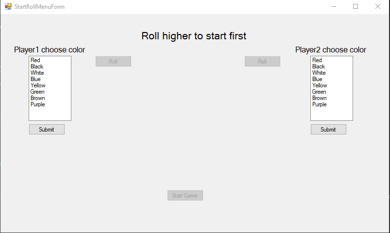
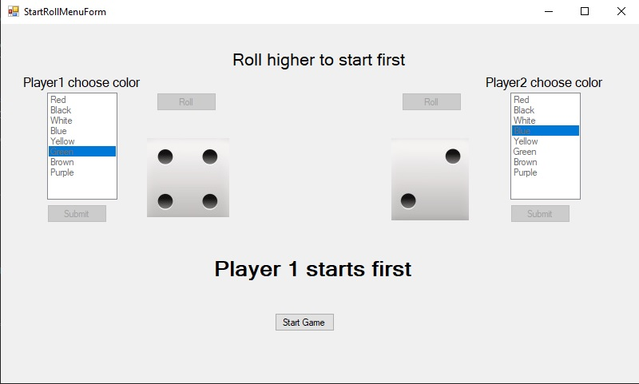
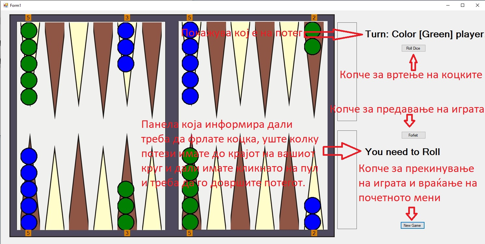
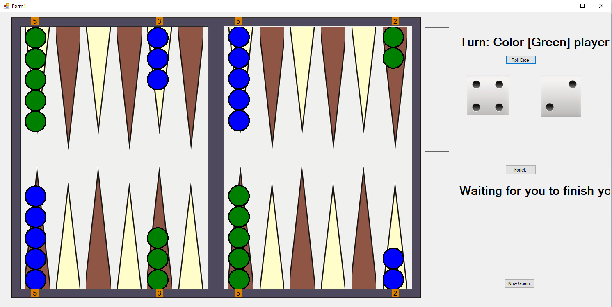
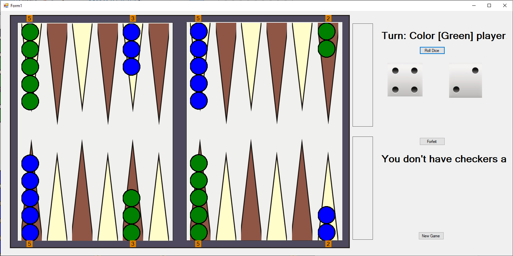
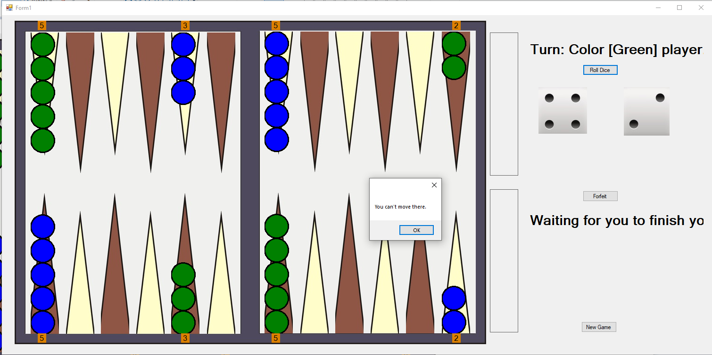
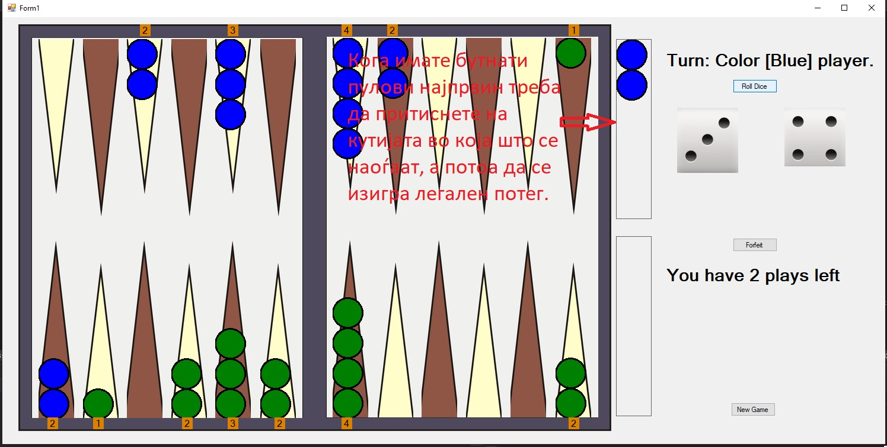
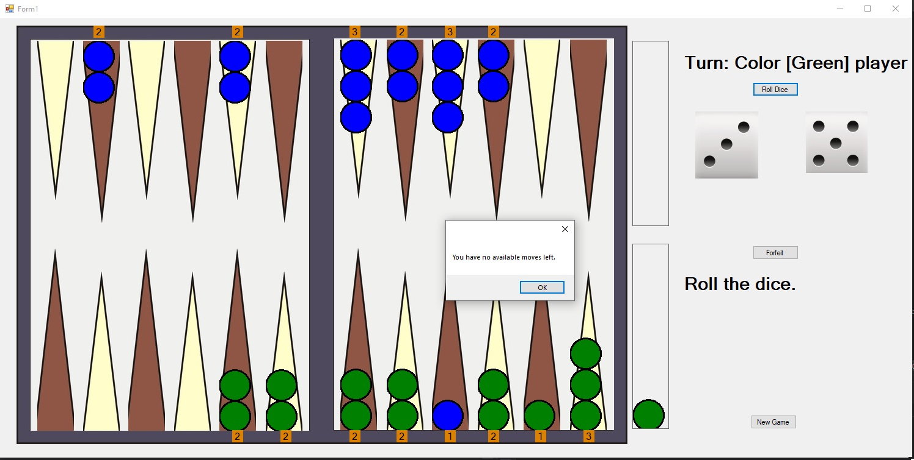
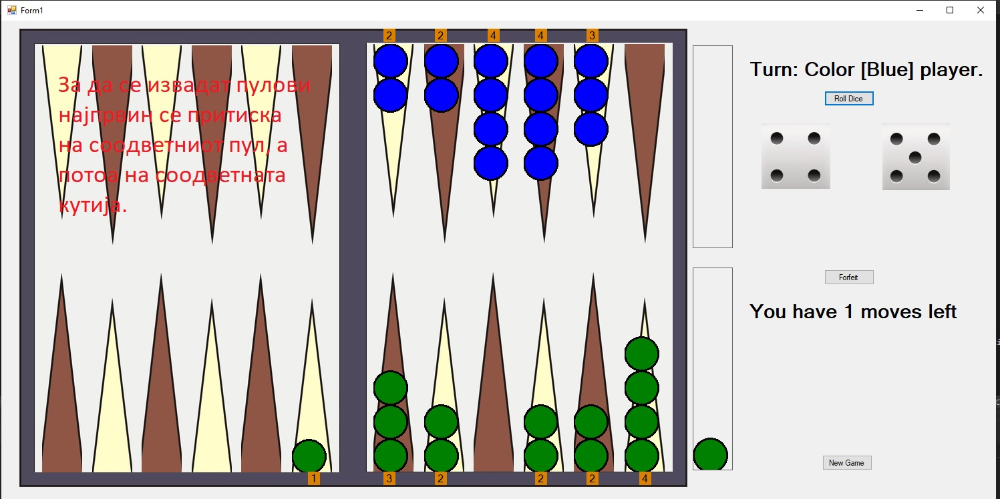
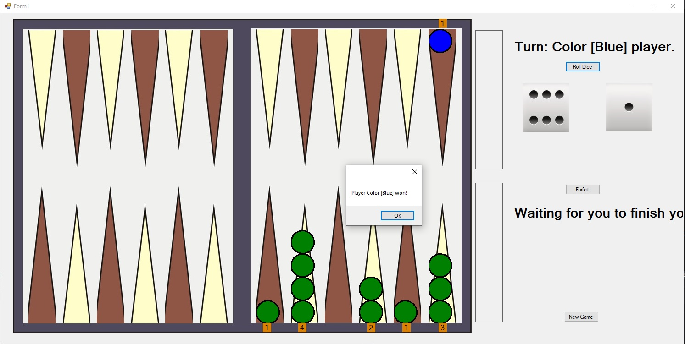

# backgammon
School project for visual programming by: Dejan Popovski, Aleksandar Nikolov and Kristijan Kosmach

Нашиот проект е изработка на познатата друштвена игра табла. Правилата за играње на играта може да се видат на следното видео https://www.youtube.com/watch?v=KDvvKWi0ijs.

По пуштање на играта се појавува почетното мени во кое двајцата играчи најпрвин треба да ја одберат бојата на своите пулови при што не може двајцата играчи да одберат иста боја.

Одкога играчите ќе ја одберат својата боја се активираат копчињата за вртење на коцките. Доколку двајцата играчи добијат различни броеви се активира копчето "Start Game".
При кликнување на "Start Game" се гаси формата во која што е почетното мени и се префрламе во формата во која што е играта и играчот со поглемата цифра на копчето може да започне со својот потег.

На наредните слики ќе се запознаеме со корисничкиот интерфејс на играта.

Кога ќе кликнете на поле од кое сакате да се движите на панелата од страна ќе ви го покаже следното.

- Доколку тоа е поле на кое што имате пулови:

НАПОМЕНА: Доколку сакате да го прекинете моменталниот потег морате да кликнете на истиот пул со кој што сте го иницирале потегот.

- Доколку тоа е поле на кое што немате пулови:

Доколку полето на кое што сте кликнале да се придвижите е неправилен потег тогаш ќе се испечати следната порака.

Доколку немате повеќе легални потези за играње ќе се покаже следната порака:

НАПОМЕНА: Под соодветна кутија се мисли на двата правоаголници до куќите на играчите. Доколку пулот ви е изваден, а не бутнат тој нема да го покаже во кутијата туку целосно ќе исчезне.

Победник е оној играч кои нема да има повеќе пулови на таблата. Пораката која го покажува победникот е следната

При решавање на проблемот користиме 6 класи, тоа се:
- Checkers - класа која чува боја на пул и има метод draw() кој ги црта пуловите на соодветните места.
- Placements - класа во која се чува бројот на пулови на одредена позиција, како и бојата на истите.
- Board - класа која ја отсликува таблата, има два метода, initializeBoard() служи за иницијализирање на таблата односно поставување на сите пулови на почетните позиции и update()
  која ги ажурира пуловите на секоја позиција доколку има некаква промена.
- Dice - класа која чува два цели броја кои ги претставуваат соодветните коцки, метода rollDices() која им поставува случаен број помеѓу 1 и 6 на двата цели броја, метода
  rolledDouble() која покажува дали тие два цели броја се еднакви и две методи diceOnePlayed() и diceTwoPlayed() кои ја поставуваат вредноста на соодветниот цел број на 0 доколку 
  коцката на која што покажуваат е изиграна.
- Player - класа која го опишува играчот, оваа класа ја чува бојата на пулови кои што може соодветниот играч да ги мрда, информација дали тој е на ред и колку пулови му се бутнати.
  Оваа класа содржи повеќе методи кои ја валидираат регуларноста на потезите на играчот. Тие се:
  - getAvailableMoves() - метод кој ги враќа сите легални потези кои што еден играч може да ги изигра. Оваа метода работи така што најпрвин проверува дали играчот има бутнати 
   пулови или не. Доколку има се повикува методот getAvailableMovesFromBar() кој ги враќа сите легални потези кои играчот може да ги изигра со пулот/пуловите кои му се надвор од
   таблата. Легитимноста на овој потег се проверува со методот isLegalFinalMove() кој проверува дали има финален потег за пуловите кои се надвор од таблата.
   Доколку нема се враќаат сите потези кој играчот може да ги изигра од сите полиња на кои има пулови со својата боја. Дали овие потези се легални се утврдува со повикување на 
   методите isLegalInitialMove() која проверува дали на одреденеата позиција се наоѓаат пулови со бојата на играчот кој е на потег, isLegalFinalMove() која проверува дали од 
   иницијалното поле има легален потег и isLegalFinalMoveEat() која проверува дали финалниот потег ќе резултира со буткање на пул на противникот.
  -getAvailableRemoveCheckerMoves() - метод кој ги враќа сите легални потези со кои што може да се тргне пул од таблата. Овој метод функционира така што најпрвин го повикува
   методот canRemoveCheckers() кој враќа "true" доколку сите пулови на играчот се наоѓаат во куќичка. Доколку може да вади пулови легитимноста на потегот се проверува со методите
   isLegalInitialMove() кој проверува дали има легален потег од соодветната позиција и isLegalRemoveCheckerMove() кој проверува дали може овој почетен потег да резултира на 
   вадење на пул.
  - addCheckersToBar() - метод кој го инкрементира бројот на пулови надвор од таблата.
  - removeCheckersFromBar() - метод кој го декрементира бројот на пулови надвор од таблата.
  - hasAvailableMoves() - враќа "True" доколку getAvailableMoves() + getAvailableRemoveCheckerMoves() > 0.
  - GetCheckersAtHome() - враќа  број на пулови кои се наоѓаат во куќа.
- GameController - класа која го контролира текот на играта. Оваа класа чува две инстанци од класата Player за дватта играчи соодветно, инстанци од класите Board и Dice, како и 
  ID на полето кое играчот планира да го направи својот потег. Методи кои ги содржи оваа класа се:
  - playerHasAvailableMoves() - кој враќа true доколку играчот кој што е на потег има легални потези за игање.
  - playerHasAvailableRemoveMoves() - кој враќа true доколку играчот кој што е на потег има право да извади пул надвор од таблата.
  - isLegalFinalMoveEat() - кој враќа true доколку играчот кој што е на потег може да бутне пул на противникот.
  - isLegalInitialMove() - кој враќа true доколку играчот кој што е на потег може да изигра легално движење од позицијата која ја има одбрано.
  - isLegalFinalMove() - кој враќа true доколку играчот кој што е на потег може да изигра легално движење од позицијата која ја има одбрано до позицијата која што ја има одбрано.
  - isLegalRemoveMove() - кој враќа true доколку играчот кој што е на потег може да го изврши соодветниот потег при вадење на пул од таблата.
  - setRemoveCheckerMove() - метод кој се справува со вадењето на пулот од таблата, ја поставува соодветна коцка дека е изиграна и го намалува бројот на пулови на таблата.
  - setPlayerInitialMove() - метод кој го иницијализира полето од кое играчот ќе го врши движењето.
  - setPlayerFinalMove() - метод кој се справува со движењето на пулот на таблата. Поставува дека соодветната коцка е изиграна и го менува местото на пулот.
  - setFinalMoveEat() - метод кој се справува со буткањето на противничкиот пул. Ја ресетира соодветната коцка која е изиграна, го придвижува соодветниот пул и противничкиот го вади.
  - swapTurns() - метода која го менува редот на играчите.
  - UpdateMovesLeft() - метода која се грижи за тоа уште колку движења има играчот кој што е на ред.
  - resetAppropriateCube() - метод кој што ја рестартира коцката која што е изиграна.
  
 
   

